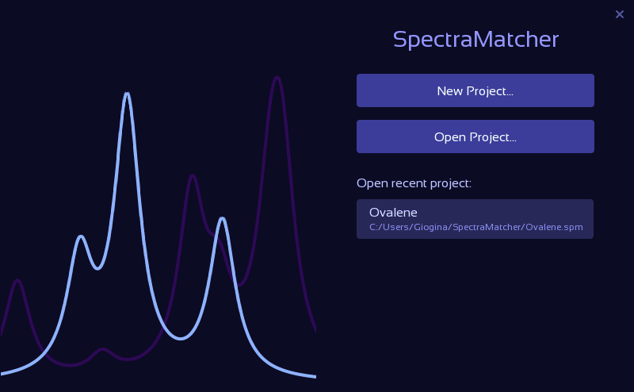
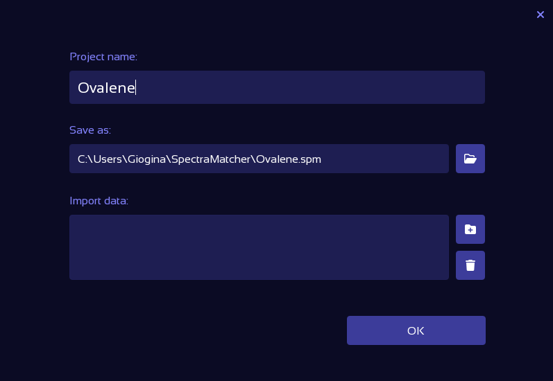

# Quick start guide

SpectraMatcher is a tool for displaying and analyzing experimental and computed vibronic spectra.

## Installation

A Windows installation file is available [here](../installer/SpectraMatcher-setup.exe). Simply download this .exe and click through the installation wizard. No special permissions are necessary.

It is recommended to keep the default installation directory.

## Startup

The startup dashboard allows to create or open a SpectraMatcher project file. These files, which have the extension .spm, are by default saved in the C:\Users\UserName\SpectraMatcher\ directory.

You may use up or down arrow keys to select a recent project, and hit enter to open it. Pressing Escape closes the dashbaord.

<figure><figcaption></figcaption></figure>

## Create a new project

Upon choosing to create a new project, you are queried to choose the project name and file location. Optionally, you can already supply data files; either by clicking the "Add folder" icon, or by dragging & dropping files or folders into the "import data" field.

<figure><figcaption></figcaption></figure>

## Import Data

After completing the initial project creation, you are presented by the "Import Data" tab, which gives an overview of all files available for analysis.project

If you added data files or folders in the previous step, the file overview panel on the left will already be populated. The "Add file" or "Add folder" icons in the top right corner of the left panel open file explorer windows to include additional data. Alternatively, files and directories can be added by dragging and dropping them into the left panel.

<figure><figcaption></figcaption></figure>

The available data files are immediately scanned to detect experimental spectra, in the form of tables, and computed spectra, in the form of Gaussian 16 output files.
See the [Import Data](File%20explorer.md) section for supported data formats and options.

Files available in the left panel can now be imported into the project. This can be done in two ways:
By manually dragging each file into its corresponding slot, or simply by clicking "Auto Import" on top of the right panel.

The "Auto Import" button becomes active as soon as the scanning of files is complete. Auto import gathers all matching files; comparing ground state energies, molecular formulas and 0-0 transition energies to ensure consistency.
If the opened data folders contain computations for more than one molecule or method, the relevant one may be selected using the drop down menu appearing under the project name.

Files imported into the project are automatically analyzed, and the respective spectra appear in the "Emission" and "Excitation" tabs.

Pressing the "Done" button performs final consistency checks, updates the project progress, and opens the emission spectra tab.

## Emission and Excitation Plots

The emission and excitation spectra corresponding to the experiment and all computed excited states are shown in the "Emission Spectra" and "Excitation Spectra" tabs.

<figure><figcaption></figcaption></figure>

The white, lower-most spectrum is the experimental spectrum, or a combination of the experimental spectra if multiple are supplied.
The computed spectra are displayed above, and listed in the left side-panel. The right panel provides controls for various plot, spectrum, and matching properties.

The various ways in which the plot and spectra can be manipulated, including moving, scaling and adjusting the half-width as well as the anharmonic correction scaling factors, are explained in the [Plot & Spectra Controls](spectra_controls.md) section.

  

