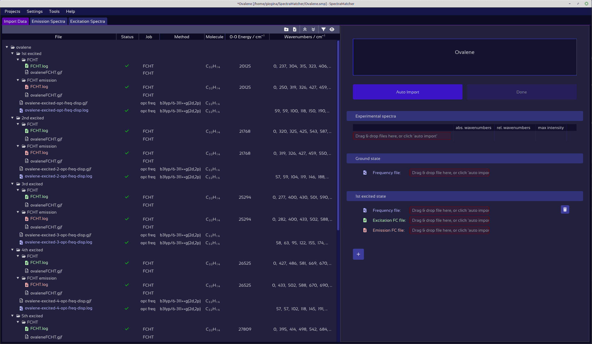

# Quick start guide

**SpectraMatcher** is a graphical tool for analyzing and matching computed and experimental vibronic spectra. It provides an intuitive interface for importing data, visualizing and interactively adjusting spectra, and automatically assigning peak correspondences.

<figure><figcaption></figcaption></figure>

The software is open source and actively maintained on [https://github.com/giogina/SpectraMatcher/](https://github.com/giogina/SpectraMatcher/tree/main), where you can find the latest releases, example files, and installation options.

## Installation

To get started with SpectraMatcher, you can either run the installation wizard for Windows or Linux, or launch it directly with Python. The instructions for each option are below.



SpectraMatcher works on **Windows 7 and newer**.

To install:

1. [Download the latest .exe](../windows_installer/SpectraMatcher-setup-1.1.0.exe) from the [windows\_installer](../windows_installer) directory of the repository.
2. Run the installation wizard and follow the on-screen instructions. It is recommended to keep the default installation directory.

No Python or additional setup is needed.\
Once installed, you can open SpectraMatcher from the Start Menu or by double-clicking any `.smp` project file.

> 💡 **Tip:** If Windows SmartScreen shows a warning, click “More info” → “Run anyway”.



The provided SpectraMatcher binary requires **glibc version 2.31 or newer**, which is typically available on Ubuntu 20.04+, Debian 11+, Fedora 32+, and most other Linux distributions released since 2020. To install it, follow these steps:

1.  [Download the latest installer](../linux_installer/SpectraMatcher_Linux_Installer_1.1.0.zip). Current version: 1.1.0.
2.  Unzip the archive:

    ```bash
    unzip SpectraMatcher_Linux_Installer_1.1.0.zip
    cd SpectraMatcher_Linux
    ```
3.  Make the installer executable:

    ```bash
    chmod +x install_spectramatcher.sh
    ```
4.  Run the installer with root permissions:

    ```bash
    sudo ./install_spectramatcher.sh
    ```

    This will:

    * Copy the application to `/opt/SpectraMatcher`
    * Install a launcher and icon
    * Register the `.smp` file extension
    * Create a Start Menu entry and optional desktop shortcut

After installation, you can launch SpectraMatcher from the Start Menu, the desktop shortcut, or by running `/opt/SpectraMatcher/SpectraMatcher` in a terminal.\
You can also open `.smp` project files directly by double-clicking.



SpectraMatcher can also be run directly from source using **Python 3.7 or newer**.\
This is useful if you want to contribute to development or run on platforms not supported by the precompiled installer.

**1. Clone the repository**

```bash
git clone https://github.com/giogina/SpectraMatcher.git
cd SpectraMatcher
```

**2. Install dependencies**





On recent Windows and Python versions, install the required libraries with:

```bash
pip install -r requirements/win-latest.txt
```



On Windows 7, only Python 3.7 is supported. Install the compatible versions of the dependencies with:

```bash
pip install -r requirements/win7.txt
```

If any packages fail to install due to missing downloads, use the [backup wheels](https://github.com/giogina/SpectraMatcher/tree/main/backup_wheels_python37).\
Make sure the provided `.dll` files remain in the main directory — some may be missing from default Windows 7 setups.





To run SpectraMatcher:

```bash
python main.py
```

Or to open a project file directly:

```bash
python main.py -open file.smp
```





First, install the required system packages:

```bash
# On Debian/Ubuntu:
sudo apt install python3-tk wmctrl xclip
```

Then, install the Python dependencies:




```bash
pip install -r requirements/unix.txt
```



For Python 3.7, older library versions are needed, which are installed with:

```bash
pip install -r requirements/unix37.txt
```




To start SpectraMatcher:

```bash
python3 main.py
```

Or to open a file directly:

```bash
python3 main.py -open file.smp
```






## [Starting a New Project](project_creation.md)

When you launch SpectraMatcher, the startup dashboard lets you open a recent project or create a new one.

To start a new project:
1. Enter a name and choose where to save it.
2. (Optional) Add your data files right away by clicking the folder icon or dragging files into the import area.

Project files use the `.smp` extension and are saved by default in `C:\Users\UserName\SpectraMatcher\` (Windows) or `~/SpectraMatcher/` (Linux).

## Import Data

After completing the initial project creation, you are presented by the "Import Data" tab, which gives an overview of all files available for analysis.project

If you added data files or folders in the previous step, the file overview panel on the left will already be populated. The "Add file" or "Add folder" icons in the top right corner of the left panel open file explorer windows to include additional data. Alternatively, files and directories can be added by dragging and dropping them into the left panel.

<figure><figcaption></figcaption></figure>

The available data files are immediately scanned to detect experimental spectra, in the form of tables, and computed spectra, in the form of Gaussian 16 output files.\
See the [Import Data](<File explorer.md>) section for supported data formats and options.

Files available in the left panel can now be imported into the project. This can be done in two ways:\
By manually dragging each file into its corresponding slot, or simply by clicking "Auto Import" on top of the right panel.

The "Auto Import" button becomes active as soon as the scanning of files is complete. Auto import gathers all matching files; comparing ground state energies, molecular formulas and 0-0 transition energies to ensure consistency.\
If the opened data folders contain computations for more than one molecule or method, the relevant one may be selected using the drop down menu appearing under the project name.

Files imported into the project are automatically analyzed, and the respective spectra appear in the "Emission" and "Excitation" tabs.

Pressing the "Done" button performs final consistency checks, updates the project progress, and opens the emission spectra tab.

## Emission and Excitation Plots

The emission and excitation spectra corresponding to the experiment and all computed excited states are shown in the "Emission Spectra" and "Excitation Spectra" tabs.

<figure><figcaption></figcaption></figure>

The white, lower-most spectrum is the experimental spectrum, or a combination of the experimental spectra if multiple are supplied.\
The computed spectra are displayed above, and listed in the left side-panel.\
The various ways in which the plot and spectra can be manipulated, including moving, scaling and adjusting the half-width, are explained in the [Plot & Spectra Controls](spectra_controls.md) section.

The right panel provides controls for various plot, spectrum, and matching properties:

### Anharmonic correction factors

The error in wavenumbers of harmonically approximated vibrations is commonly reduced by applying a correction factor to all wavenumbers.\
SpectraMatcher allows for even finer control:
