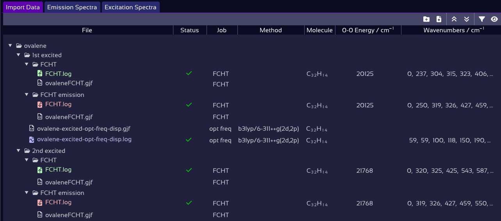

# About SpectraMatcher

**SpectraMatcher** is a graphical tool for analyzing and matching computed and experimental vibronic spectra. It provides an intuitive interface for importing data, visualizing and interactively adjusting spectra, and automatically assigning peak correspondences.

The software is open source and actively maintained on [https://github.com/giogina/SpectraMatcher/](https://github.com/giogina/SpectraMatcher/tree/main), where you can find the latest releases, example files, and installation options.

Check out the features below, or jump right to the [Quick Start Guide](quickstart.md).

<figure><figcaption></figcaption></figure>

# Features

## [Smart import & auto-detection of Gaussian files](file_explorer.md#file-explorer)

SpectraMatcher scans all added files — including entire folders — to automatically detect and classify Gaussian frequency and Franck-Condon/Herzberg-Teller computations, as well as experimental spectra. Icons indicate job type and status (complete, error, negative frequencies), while additional data (molecular formula, method, $$ \nu_{00} $$, etc.) is extracted on the fly.

<figure><figcaption>Gaussian jobs are scanned and labeled automatically during import.</figcaption></figure>

All matching files can be conveniently imported with a single click on the **Auto Import** button.

## [Supports messy real-world data](file_explorer.md#experimental-spectra-files)

Experimental spectra in `.txt`, `.csv`, Excel, or OpenOffice format are recognized automatically — even without column headers. SpectraMatcher recognizes column roles based on trends and values; manual correction is a right-click away.

<figure><figcaption>Fix broken data tables with a click.</figcaption></figure>

It also distinguishes excitation vs. emission based on filename keywords, so you can batch-import with minimal prep.

## [Vibrational mode animations](spectra_controls.md#vibrational-mode-animations)

Visualize what vibrational mode is responsible for a peak by clicking its label to animate the molecular motion: 

<figure><figcaption></figcaption></figure>

## [Clean, publication-ready export](exports.md)

After matching peaks, you can copy the peak assignment table directly as tab-separated text, or nicely formatted as Word or LaTeX — ready to paste straight into your paper.

<figure><figcaption>LaTeX export — no manual formatting required.</figcaption></figure>

Or take a screenshot of the annotated spectrum — perfect for slides, figures, or sharing your results.

<figure><figcaption>Plot of labeled, matched vibronic spectra.</figcaption></figure>

