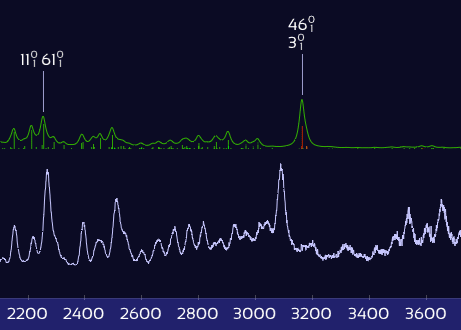

# About SpectraMatcher

## SpectraMatcher: A vibronic spectra analysis tool.

**SpectraMatcher** is a graphical tool for analyzing and matching computed and experimental vibronic spectra. It provides an intuitive interface for importing data, visualizing and interactively adjusting spectra, and automatically assigning peak correspondences.

The software is open source and actively maintained on [github.com/giogina/SpectraMatcher/](https://github.com/giogina/SpectraMatcher/), where you can find the latest releases, example files, and installation options.

Check out the features below, or jump right to the [Quick Start Guide](quickstart.md).

<figure><figcaption></figcaption></figure>

## Features

### [Smart import & auto-detection of Gaussian files](file_explorer.md#file-explorer)

SpectraMatcher scans all added files — including entire folders — to automatically detect and classify Gaussian frequency and vibronic (Franck-Condon/Herzberg-Teller) computations, as well as experimental spectra. Icons indicate job type and status (complete, error, negative frequencies), while additional data (molecular formula, method, $$u_{00}$$, etc.) is extracted on the fly.

<figure><figcaption>
Gaussian jobs are scanned and labeled automatically during import.
</figcaption></figure>

All matching files can be conveniently imported with a single click on the **Auto Import** button.

### [Supports messy real-world data](file_explorer.md#experimental-spectra-files)

Experimental spectra in `.txt`, `.csv`, Excel, or OpenOffice format are recognized automatically — even without column headers. SpectraMatcher recognizes column roles based on trends and values; manual correction is a right-click away.

<figure><figcaption>
Fix broken data tables with a click.
</figcaption></figure>

It also distinguishes excitation vs. emission based on filename keywords, so you can batch-import with minimal prep.

### [Interactive spectra adjustments - right in the plot](plot_controls.md)

No need to hunt for controls — just grab and drag. Move entire spectra, shift peaks, adjust widths, or reposition labels by interacting directly with the plot. Hold Alt to show all available handles.

<figure><figcaption>
Quickly shift wavenumbers or adjust peak broadening.
</figcaption></figure>

<figure><figcaption>
Drag labels to reposition them exactly where you want.
</figcaption></figure>

### [Fine-tuning of anharmonic corrections](spectra_controls.md#anharmonic-correction-factors)

Computed spectra often overestimate vibrational frequencies due to the harmonic approximation. SpectraMatcher lets you correct this — not just globally, but per **vibration type**: X–H stretches, out-of-plane bends, and other modes can each have their own correction factor.

<figure><figcaption>
Each vibrational mode type gets its own correction factor.
</figcaption></figure>

Vibrational modes are auto-classified based on their displacement vectors, and sticks in the spectrum are color-coded by type (e.g. red = X–H stretch). Adjust the sliders, and watch matching peaks snap into place:

<figure><figcaption>
Only X–H stretch peaks shift — the rest stay put.
</figcaption></figure>

This lets you apply physically meaningful corrections with high precision — and without overfitting.

### [Vibrational mode animations](spectra_controls.md#vibrational-mode-animations)

Visualize what vibrational mode is responsible for a peak by clicking its label to animate the molecular motion:

<figure><figcaption></figcaption></figure>

### [Build composite spectra from excited states](spectra_controls.md#composite-spectrum)

Overlay spectra from multiple excited states into a single composite — perfect when experimental peaks arise from overlapping transitions. Click spectra or use checkboxes to include/exclude components in real time.

<figure><figcaption>
Interactively overlay excited-state contributions and see how well they explain experiment.
</figcaption></figure>

Display the result as a single curve, stacked colored components, or shaded areas. A powerful tool when one state isn't enough.

### [Clean, publication-ready export](exports.md)

After matching peaks, you can copy the peak assignment table directly as tab-separated text, or nicely formatted as Word or LaTeX — ready to paste straight into your paper.

<figure><figcaption>
LaTeX export — no manual formatting required.
</figcaption></figure>

Or take a screenshot of the annotated spectrum — perfect for slides, figures, or sharing your results.

<figure><figcaption>
Plot of labeled, matched vibronic spectra.
</figcaption></figure>
