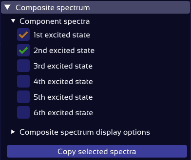

# Export of Results

Once your spectra are aligned and peak matching is complete, SpectraMatcher lets you export your results in formats ready for publication or further analysis.

## Export Peak Assignment Table

The table of matched peaks — including intensities, transition labels, and wavenumbers — can be exported in several publication-ready formats:

- **.txt** (tab-separated plain text) compatible with spreadsheet software and scientific plotting tools
- **.docx** ([Word](https://www.microsoft.com/en-us/microsoft-365/word)) for easy insertion into reports or manuscripts
- **.tex** ([LaTeX](https://www.latex-project.org/)) for direct inclusion in scientific publications

Choose the format in the drop-down menu in the **Match settings** panel, then click **Copy table** to copy the data to your clipboard, ready to paste into your text editor of choice.

<figure></figure>

> 💡 The copying functionality uses the clipboard tool installed on your system. On linux, this requires e.g. xclip to be installed — this is done automatically by SpectraMatcher's installation script.

The copied table contains exactly the data visible in the assignment table in SpectraMatcher. The plain-text version is kept minimally formatted, to facilitate further analysis, e.g. in spreadsheet software.
The Word and LaTeX tables feature properly aligned columns and math-mode formatting for vibrational mode labels:
<figure><figcaption>Example of the exported LaTeX table as rendered in a document.</figcaption></figure>

> 💡 Ensure you use `\usepackage{booktabs}` in your preamble to enable proper formatting of the LaTeX table. Alternatively, replace the `\toprule` etc. by `\hline` commands.

## Export Vibrational Spectra Data

To export the underlying numerical data of the computed convoluted spectra, open the **Composite Spectrum** panel, select the spectra you are interested in, and click **Copy selected spectra**.

<figure></figure>

This copies the spectra to your clipboard as a table of tab-separated values:

```
  wn	1st excited state	2nd excited state
-1407	0.000032480408839	0.000000000000000
-1406	0.000032521969516	0.000000000000000
-1405	0.000032563613408	0.000000000000000
-1404	0.000032605340743	0.000083004864619
-1403	0.000032647151750	0.000083079005553
-1402	0.000032689046656	0.000083153252491
-1401	0.000032731025694	0.000083227605648
-1400	0.000032773089094	0.000083302065240
-1399	0.000032815237086	0.000083376631482
-1398	0.000032857469904	0.000083451304590
-1397	0.000032899787782	0.000083526084784
-1396	0.000032942190952	0.000083600972279
...
```

You can paste this into a spreadsheet, plotting tool, or save it to a `.txt` file.

## Plot Export

The plot can be toggled to light mode (white background) by pressing the ☾ icon in the Plot settings title bar:

<figure></figure>

To copy this plot, simply take a screenshot.

> 💡 To screenshot only the plot area, use these tools:
> - **Windows**: Press `Win + Shift + S` to open the Snipping Tool. The selected region is copied to your clipboard.
> - **Linux**: Press `Shift + PrtScrn`to select a region of the screen.
> - **macOS**: Press `Cmd + Shift + 4` and drag to capture a region. The screenshot is saved to your desktop by default.


<figure></figure>

