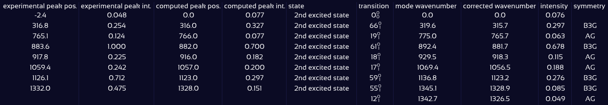

# Vibronic Spectrum Matching

SpectraMatcher can automatically match peaks of computed and experimental fluorescence and excitation spectra, based on the peak's proximity and intensity. This allows you to quickly identify which vibronic transitions contribute to which features in the experimental spectrum — even in complex, overlapping cases. The detected peak assignments, together with respective wavenumbers, peak intensities, involved vibrational modes and excited states, are listed in a peak assignment table, which can be conveniently [exported in various formats](exports.md#export-peak-assignment-table), e.g. as LaTeX table suitable for direct inclusion in publications.

## Activation of Peak Matching

The automatic matching algorithm matches the experimental data to a [**composite spectrum**](spectra_controls.md#composite-spectrum) — a sum of selected computed excited-state vibronic spectra. (Of course, you can also include just a single excited state here.) By default, when matching is first activated and no composite spectrum has been manually selected, all currently visible computed spectra are added to the composite.

To activate automatic matching, open the **Match settings** panel and check the box labeled **Match peaks**.

<figure><figcaption></figcaption></figure>

## Matching Parameters

Once enabled, SpectraMatcher assigns experimental peaks to computed ones based on **wavenumber proximity** and **relative intensity**. For both of these metrics, threshold values can be set using the sliders:

*   **Distance** threshold $$\tau_{\Delta \tilde{\nu}}$$: Only peaks with a small enough wavenumber difference

    $$
    |\tilde{\nu}_\text{exp} - \tilde{\nu}_\text{comp} | \leq \tau_{\Delta \tilde{\nu}}
    $$

    are matched.
*   **Rel. intensity** threshold $$\tau_I$$: Only peaks with sufficiently similar intensity, i.e.

    $$
    \frac{i_\text{exp}}{i_\text{comp}} \geq \tau_I \leq \frac{i_\text{comp}}{i_\text{exp}}
    $$

    are matched. The setting $$\tau_I=1$$ would allow only equally-sized peaks to be matched; $$\tau_I=0$$ imposes no restrictions. (Note that intensities within each spectrum are defined relative to its highest peak.)

To fine-tune the amount of assigned peaks, you can also enable **“Assign only labeled peaks”** — this restricts matching to only those computed peaks that are currently labeled in the plot (based on your label display settings).

<figure><figcaption></figcaption></figure>

## Peak Assignment Table

When peak matching is active, a table of peak assignments can be shown below the plot by clicking **"Show assignment table"**. It includes:

* The position and intensity of each experimental peak,
* The position and intensity of the corresponding peak in the computed (composite) spectrum,
* For each transition contributing to the computed peak:
  * The excited state the transition belongs to
  * The transition label (in either Mulliken or Gaussian notation, based on the label settings)
  * wave number, corrected wave number, and intensity
  * symmetry
  * vibration type (X-H stretch, OOP bend, or other)

<figure><figcaption></figcaption></figure>

The size and detail of the table depend on your settings:

* If **Assign only labeled peaks** is checked, the table shows only labeled transitions.
* If unchecked, the table includes **all transitions** contributing to matched peaks — this may be large for complex spectra.

> 💡 To export the match table, see the [Export of Results](exports.md) section.

### Interactive Features

* **Hover** over a row in the table: The corresponding match line is highlighted in the plot (if the mode visualization panel is collapsed).
* **Click** a row with the **mode visualization panel open**: The first vibrational mode of the corresponding transition [is animated](spectra_controls.md#vibrational-mode-animations).
