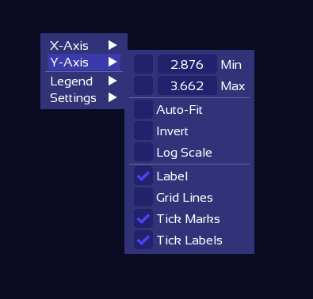
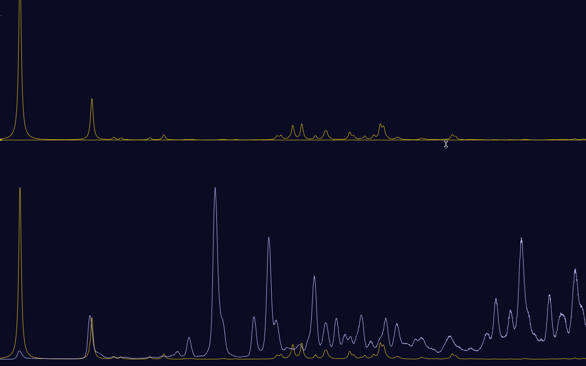
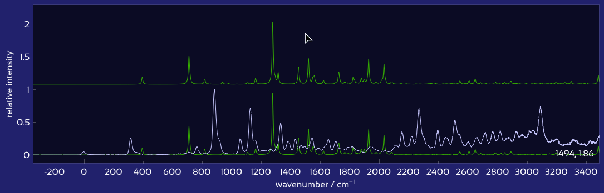

# Interactive Plot Controls

The "Emission Spectra" and "Excitation Spectra" tabs display plots of the respective experimental and computed spectra, together with a variety of control options:

<figure><figcaption></figcaption></figure>

* The **experimental spectrum** (white) is shown at the bottom.
* Each **computed spectra** are plotted above and color-coded by excited state.
* The left panel lists each computed excited state and provides individual control sliders.
* The right panel contains global controls.
* Matched peaks, labels, and assignments are shown as overlays directly on the plot.

To learn about the functionalities provided by these controls — such as adjusting half-width, scaling spectra, or applying anharmonic corrections — see [Spectra Controls](spectra_controls.md).

This section covers useful tips and tricks for interacting with the spectrum controls and plot efficiently:

* [Plot zoom and pan](plot_controls.md#plot-controls-zoom--pan)
* [Slider controls](plot_controls.md#slider-controls)
* [Data manipulation directly in the plot](plot_controls.md#data-manipulation-directly-in-the-plot)

## Plot controls: Zoom & Pan

The plot can be zoomed with constant aspect ratio by scrolling while the mouse is hovered over a by scrolling while hovering the mouse over an empty area of the plot (i.e., not over a spectrum).\
To zoom only in x or y direction, hover the mouse over the corresponding axis and scroll.

In the same way, the plot can be dragged freely by clicking into the free plot area, or along one axis only by dragging the axis:



Zoom into an interesting region by right-click-dragging over it. Double click the plot to zoom out to show all contents.

Alternatively, to set exact axis limits, right-click the axis (or the plot area and select X/Y axis), Ctrl+click the relevant min/max number, and enter the desired number.

Further axis and plot options are available in the plot context menu under "X/Y axis" and "Settings":

<figure><figcaption></figcaption></figure>

## Slider controls

All sliders can be changed by dragging the handle or by scrolling the mouse wheel while hovering the mouse over the slider.

Alternatively, an exact numerical value can be entered after holding Control and left-clicking the slider.

The arrow keys adjust the last altered slider in the corresponding direction:\
The vertical arrow keys ↑ ↓ alter the most recently changed vertical spectrum shift, spectrum scale, or global vertical spacing.\
The horizontal arrow keys ← → adjust the most recently changed spectrum wavenumber shift, half width, or anharmonic correction factor.

Holding down Shift while scrolling or using arrow buttons allows for finer adjustments.

## Data manipulation directly in the plot

### Plot drag lines

Spectra can be manipulated directly in the plot, using certain drag lines which appear when the mouse pointer is close enough. All available drag lines can be shown by holding down the Alt button.\
Hovering the mouse near the base of the spectrum reveals a drag line which can be used to vertically drag the spectrum. While this line is being hovered, scrolling the mouse wheel scales the corresponding spectrum:

<figure><figcaption></figcaption></figure>

Similarly, hovering the mouse at the position of the highest peak reveals a line which can be used to horizontally drag the spectrum. Scrolling while this drag line is hovered adjusts the half-width of the computed spectra.\
Note that the half-width is a global variable applied to all computed spectra, as it should not depend on the choice of excited state.

<figure><figcaption></figcaption></figure>

As with sliders, holding down the Shift button causes a finer adjustment while scrolling.
