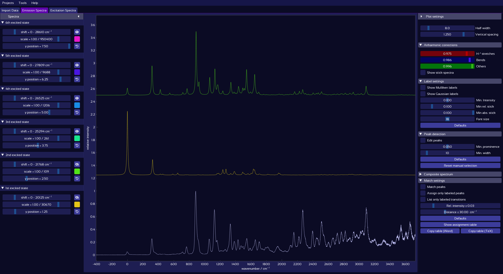

# Interactive Plot Controls

The "Emission Spectra" and "Excitation Spectra" tabs display plots of the respective experimental and computed spectra, together with a variety of control options:

<figure><figcaption></figcaption></figure>

* The **experimental spectrum** (white) is shown at the bottom.
* All **computed spectra** are plotted above and color-coded by excited state.
* The left panel lists each computed excited state and provides individual control sliders.
* The right panel contains global controls.
* Matched peaks, labels, and assignments are shown as overlays directly on the plot.

To learn about the functionalities provided by these controls — such as adjusting half-width, scaling spectra, or applying anharmonic corrections — see [Spectra Controls](spectra_controls.md).

This section covers useful tips and tricks for interacting with the plot and spectrum controls efficiently:

* [Plot zoom and pan](plot_controls.md#plot-controls-zoom--pan)
* [Sliders](plot_controls.md#sliders)
* [Data manipulation directly in the plot](plot_controls.md#data-manipulation-directly-in-the-plot)

These features are based on [DearPyGui](https://dearpygui.readthedocs.io/en/latest/index.html)'s responsive [interactive plotting functionality](https://dearpygui.readthedocs.io/en/latest/documentation/plots.html).

## Plot controls: Zoom & Pan

The plot can be zoomed with constant aspect ratio by scrolling while hovering the mouse over an empty area of the plot (i.e., not over a spectrum).
To zoom only in x or y direction, hover the mouse over the corresponding axis and scroll.

In the same way, the plot can be dragged freely by clicking into the free plot area, or along one axis only by dragging the axis.

<figure><figcaption>Zoom or drag the plot, or individual axes.</figcaption></figure>

Zoom into an interesting region by right-click-dragging over it. Double-click the plot to zoom out to show all contents.

<figure><figcaption>Zoom into a plot region by right-clicking and dragging.</figcaption></figure>

Alternatively, to set exact axis limits, right-click the axis (or the plot area and select X/Y axis), Ctrl+click the relevant min/max number, and enter the desired number.

Further axis and plot options are available in the plot context menu under "X/Y axis" and "Settings":

<figure><figcaption></figcaption></figure>

## Sliders

<figure><figcaption></figcaption></figure>

All sliders can be changed in four different ways:
* **Dragging the handle**,
* **Scrolling the mouse wheel** while hovering the mouse over the slider,
* **Ctrl+Click** to enter an exact numerical value (confirm with **Enter**),
* Using **arrow keys** to adjust the last altered slider in the corresponding direction:
  * The vertical arrow keys **↑ ↓** alter the most recently changed vertical spectrum shift, spectrum scale, or global vertical spacing.
  * The horizontal arrow keys **← →** adjust the most recently changed spectrum wavenumber shift, half width, or anharmonic correction factor.

Holding down **Shift** while scrolling or using arrow keys allows for finer adjustments.

## Data manipulation directly in the plot

The plot contains a number of hidden objects, which are revealed when you hover the mouse nearby, and can be used to manipulate the plotted data. This includes:
* [Plot drag lines](#plot-drag-lines): Horizontal and vertical lines for each excited state plot, used to move or scale the plot, or adjust the half-width.
* [Label drag handles](#label-drag-handles): Dots attached to each label, which can be used to drag the label to a desired location.

### Plot drag lines

Spectra can be manipulated directly in the plot, using drag lines which appear when the mouse pointer is close enough. All available drag lines can be shown by holding down the **Alt** button. Each line can be dragged, as well as scrolled while hovered; with different effects:
* **The horizontal drag line at the base of each spectrum** can be used to vertically drag the spectrum. The spectrum can be re-scaled by scrolling the mouse wheel while this line is being hovered:

<figure><figcaption></figcaption></figure>

Similarly, hovering the mouse at the position of the highest peak reveals a line which can be used to horizontally drag the spectrum. Scrolling while this drag line is hovered adjusts the half-width of the computed spectra.
Note that the half-width is a global variable applied to all computed spectra, as it should not depend on the choice of excited state.

<figure><figcaption></figcaption></figure>

As with sliders, holding down the **Shift** key causes a finer adjustment while scrolling.

### Label drag handles
By hovering over a label, a yellow drag handle is revealed at its bottom, which can be used to move the label:

<figure><figcaption>Hovering over a label reveals a yellow drag handle. Use it to drag the label to your desired location.</figcaption></figure>
