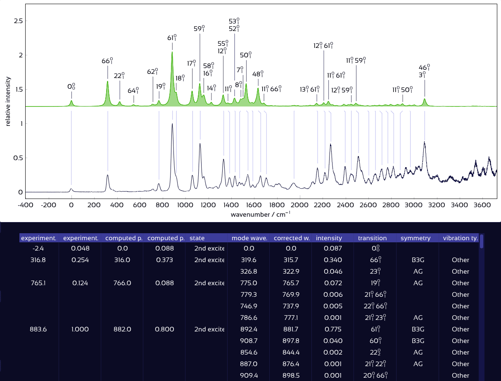

# Quick start guide


## Installation

To get started with SpectraMatcher, you can either run the installation wizard for Windows or Linux, or launch it directly with Python. The instructions for each option are below.



SpectraMatcher works on **Windows 7 and newer**.

To install:

1. [Download the latest .exe](../windows_installer/SpectraMatcher-setup-1.1.0.exe) from the [windows\_installer](../windows_installer) directory of the repository.
2. Run the installation wizard and follow the on-screen instructions. It is recommended to keep the default installation directory.

No Python or additional setup is needed.\
Once installed, you can open SpectraMatcher from the Start Menu or by double-clicking any `.smp` project file.

> 💡  If Windows SmartScreen shows a warning, click “More info” → “Run anyway”.




The provided SpectraMatcher binary requires **glibc version 2.31 or newer**, which is typically available on Ubuntu 20.04+, Debian 11+, Fedora 32+, and most other Linux distributions released since 2020. To install it, follow these steps:

1.  [Download the latest installer](../linux_installer/SpectraMatcher_Linux_Installer_1.1.0.zip). Current version: 1.1.0.
2.  Unzip the archive:

    ```bash
    unzip SpectraMatcher_Linux_Installer_1.1.0.zip
    cd SpectraMatcher_Linux
    ```
3.  Make the installer executable:

    ```bash
    chmod +x install_spectramatcher.sh
    ```
4.  Run the installer with root permissions:

    ```bash
    sudo ./install_spectramatcher.sh
    ```

    This will:

    * Copy the application to `/opt/SpectraMatcher`
    * Install a launcher and icon
    * Register the `.smp` file extension
    * Create a Start Menu entry and optional desktop shortcut

After installation, you can launch SpectraMatcher from the Start Menu, the desktop shortcut, or by running `/opt/SpectraMatcher/SpectraMatcher` in a terminal.\
You can also open `.smp` project files directly by double-clicking.



SpectraMatcher can also be run directly from source using **Python 3.7 or newer**.\
This is useful if you want to contribute to development or run on platforms not supported by the precompiled installer.

**1. Clone the repository**

```bash
git clone https://github.com/giogina/SpectraMatcher.git
cd SpectraMatcher
```

**2. Install dependencies**





On recent Windows and Python versions, install the required libraries with:

```bash
pip install -r requirements/win-latest.txt
```



On Windows 7, only Python 3.7 is supported. Install the compatible versions of the dependencies with:

```bash
pip install -r requirements/win7.txt
```

If any packages fail to install due to missing downloads, use the [backup wheels](https://github.com/giogina/SpectraMatcher/tree/main/backup_wheels_python37).\
Make sure the provided `.dll` files remain in the main directory — some may be missing from default Windows 7 setups.





To run SpectraMatcher:

```bash
python main.py
```

Or to open a project file directly:

```bash
python main.py -open file.smp
```





First, install the required system packages:

```bash
# On Debian/Ubuntu:
sudo apt install python3-tk wmctrl xclip
```

Then, install the Python dependencies:




```bash
pip install -r requirements/unix.txt
```



For Python 3.7, older library versions are needed, which are installed with:

```bash
pip install -r requirements/unix37.txt
```




To start SpectraMatcher:

```bash
python3 main.py
```

Or to open a file directly:

```bash
python3 main.py -open file.smp
```






## Starting a New Project

When you launch SpectraMatcher, the startup dashboard lets you open a recent project or create a new one.

When you start a new project:
1. Enter a name and choose where to save it.
2. (Optional) Add your data files right away by clicking the folder icon or dragging files into the import area.

Project files use the `.smp` extension and are by default saved in a `{home}/SpectraMatcher/` directory.

> 💡 In the startup dashboard, select a recent project using the 🡻 🡹 keys, Enter to open, Escape to close.

## Data Import

After creating a project, you’ll be taken to the **Import Data** tab. This screen shows all files available for analysis, together with their types and an overview of their contents.

If you added data in the setup screen, they’ll already be listed in the left-hand panel. You can add more files at any time by:
- Clicking the **“Add file”** or **“Add folder”** buttons in the top-right, or
- Dragging and dropping files or folders into the left panel (Windows only).

<figure><figcaption></figcaption></figure>

Once files are detected, click the **Auto Import** button to automatically gather and import compatible data.

> 💡 Auto Import checks for consistency in geometry, method, and 0–0 transition energy.  
> You can also manually assign files by dragging them into the corresponding slots.

For supported file types and further import options, see the [Data Import](file_explorer.md) section.

When you're ready, click **Done** to proceed to the spectrum viewer.


## Emission and Excitation Spectra

Once data is imported, the **Emission** and **Excitation** tabs display both the experimental spectrum (white) and computed spectra (colored by excited state).

<figure><figcaption></figcaption></figure>

The **experimental spectrum** appears at the bottom (white), and any **computed excited states** are shown above it.

You can:
- **Toggle and manipulate spectra** in the left-hand list,
- **Move and scale** individual spectra directly in the plot,
- Adjust **peak widths** and **anharmonic correction factors** of the computed spectra,
- Display customizable **transition labels**,
- Refine the detected **experimental peaks**,
- Or visualize individual vibrational modes.

> 💡 Changes are reflected immediately — no need to reprocess or reload.

For details on intensity scaling, shifting spectra, and adjusting anharmonic correction factors, see the [Spectra Controls](spectra_controls.md) section.

## Automatic Peak Matching

Once the computed spectra are satisfactorily aligned with the experiment, automatic peak matching can be enabled by checking the **Match Peaks** box near the bottom of the right-hand panel.

SpectraMatcher will then assign the corresponding peaks between the experimental and computed spectra, based on wavenumber proximity and relative intensity.
Matched peaks are indicated by vertical lines, and a detailed assignment table is generated.

<figure><figcaption></figcaption></figure>


For advanced matching options and details on how scores are computed, see the [Matching](matching.md) section.

### Exporting Results

Once the spectra are aligned and peaks have been matched, SpectraMatcher allows you to export your results in several convenient formats.

#### Assignment Table
The table of matched peaks — including wavenumbers, intensities, and transition labels — can be exported as:
- **Tab-separated values** for spreadsheets or data processing
- **Word (.docx)** for inclusion in reports
- **LaTeX (.tex)** for publication-ready formatting

Choose your preferred format from the menu at the bottom of the **Match Settings** dropdown, and use the **Copy Table** button to copy the table to your clipboard.

#### Spectrum Data
To export numerical data for the convoluted computed spectra, open the **Composite Spectrum** dropdown, select the spectra you are interested in, and click **Copy selected spectra** to copy the full spectrum, as tab-separated text, to your clipboard.

This data includes wavenumber–intensity pairs and can be pasted directly into analysis tools or plotting software.

#### Plot
Export of the displayed plot is not currently implemented, but you can simply take a screenshot.

> 💡 Click the moon icon on the top right to toggle the spectrum between dark and light mode. Use the `Snipping Tool` on Windows or `Shift`+`PrtScr` on Linux to take a screenshot of only your desired area.

For more options and export formats, see the [Export](exports.md) section.


