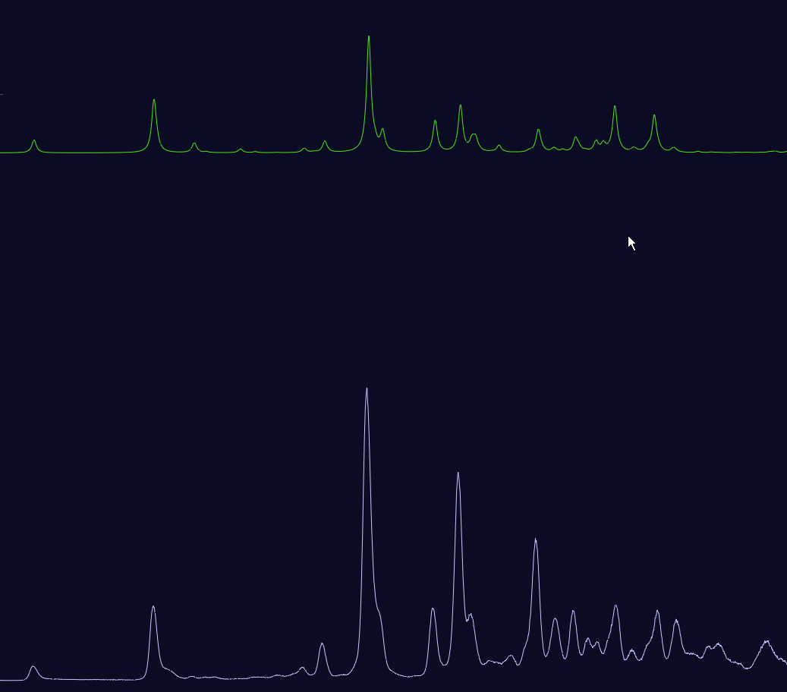

# Emission and Excitation Spectra Visualization and Controls

## Zoom & Pan
The plot can be zoomed with constant aspect ratio by scrolling while the mouse is hovered over a non-interactive part of the plot (more on the interactive parts below).
To zoom only in x or y direction, hover the mouse over the corresponding axis and scroll.

Equivalently, the plot can be dragged freely by clicking into the free plot area, or along one axis only by dragging the axis.
 
Zoom into an interesting region by right-click-dragging over it. Double click the plot to zoom out to show all contents.

Alternatively, to set exact axis limits, right-click the axis (or the plot area and select X/Y axis), Ctrl+click the relevant min/max number, and enter the desired number.

Further axis and plot options are available in the plot context menu under "X/Y axis" and "Settings": 

<figure>  <figcaption></figcaption></figure>

## Slider controls

All sliders can be changed by dragging the handle or by scrolling the mouse wheel while hovering the mouse over the slider.

Alternatively, an exact numerical value can be entered after holding Control and left-clicking the slider.

The arrow keys adjust the last altered slider in the corresponding direction:
The vertical arrow keys ↑ ↓ alter the most recently changed vertical spectrum shift, spectrum scale, or global vertical spacing.
The horizontal arrow keys ← → adjust the most recently changed spectrum wavenumber shift, half width, or anharmonic correction factor. 

Holding down Shift while scrolling or using arrow buttons allows for finer adjustments.

## Moving and scaling computed spectra

The computed spectra can be moved horizontally and vertically, as well as scaled vertically, in three ways:

### Spectra control panel
Each spectrum can be individually moved using its corresponding sliders in the left control panel:
<figure><figcaption></figcaption></figure>
Additionally, using the buttons on the right-hand side of this section, one can hide the spectrum from the plot, choose its color, and reset the shift & scale parameters.

### Plot drag lines
Spectra can be manipulated directly in the plot, using certain drag lines which appear when the mouse pointer is close enough. All available drag lines can be shown by holding down the Alt button.
Hovering the mouse near the base of the spectrum reveals a drag line which can be used to vertically drag the spectrum. While this line is being hovered, scrolling the mouse wheel causes a scaling of the corresponding spectrum:
 
<figure><figcaption></figcaption></figure>

Similarly, hovering the mouse at the position of the highest peak reveals a line which can be used to horizontally drag the spectrum. Scrolling while this drag line is hovered adjusts the half-width of the computed spectra. 
Note that the half-width is a global variable applied to all computed spectra, as it should not depend on the choice of excited state.

<figure><figcaption></figcaption></figure>

As with sliders, holding down the Shift button causes a finer adjustment while scrolling.

### Global vertical spacing
The global "vertical spacing" slider on the top right places all visible spectra equidistantly.

