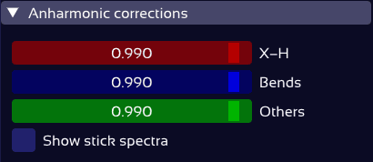
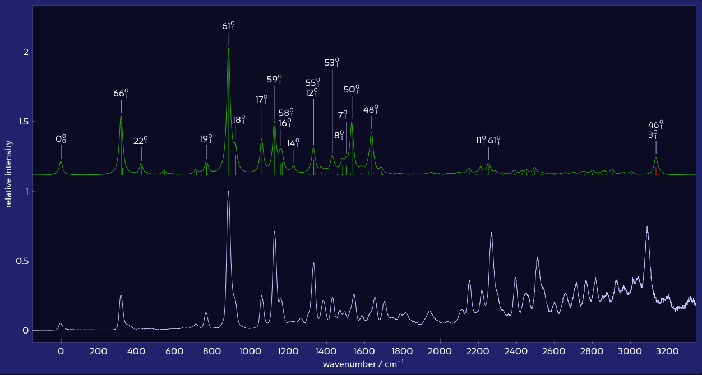

# Spectra Controls

This section explains the various ways in which the vibronic emission and excitation spectra can be manipulated:
* [**Moving and scaling**](#moving-and-scaling-computed-spectra) of computed spectra
* Setting the [**half-width**](#peak-half-width) of computed spectra
* Applying [**anharmonic correction factors**](#anharmonic-correction-factors) to different vibration types
* Showing customizable [**transition labels**](#transition-labels)
* [**Animating vibrational modes**](#vibrational-mode-animations)
* Adjusting the (auto-detected) [**experimental peak positions**](#experimental-peak-detection)
* Overlaying [**composite computed spectra**](#composite-spectrum) onto the experimental one

## Moving and scaling computed spectra

The computed spectra can be moved horizontally (i.e., adjusting their wavenumber offset) and vertically, as well as scaled, in three equivalent ways:

### Directly in the plot

Each computed spectrum possesses two hidden drag lines - a horizontal line at its base, and a vertical line at its largest peak. These lines can be used to move the spectrum (click & drag), and to scale its intensity or peak width (hover & scroll). [Click here](plot_controls.md#plot-drag-lines) to read more about drag lines.

### Spectra control panel

The panel to the left of the plot contains controls for individual computed spectra:

<figure><figcaption></figcaption></figure>

In addition to the sliders for **wavenumber shift**, spectrum intensity **scaling**, and **vertical position** in the plot, the three buttons on the left let you **toggle spectrum visibility** off/on, choose the spectrum's **display color**, and **reset** the shift & scale parameters.

### Global vertical spacing

The global "vertical spacing" slider on the top right places all visible spectra on equidistant vertical positions. For example, setting this vertical offset to 0 will overlay all spectra:

<figure><figcaption></figcaption></figure>

## Peak half-width

The displayed computed spectral profiles are obtained by convolution of the transition stick spectra with a [Lorentzian](https://en.wikipedia.org/wiki/Spectral_line_shape#Lorentzian) profile, using a user-defined half-width. This half-width can be set in two equivalent ways:
* Using the half-width slider on the top-right, or 
* By hovering the vertical drag line on the highest peak, and scrolling the mouse wheel:

<figure><figcaption></figcaption></figure>

## Transition labels

Transition labels in the spectrum can be shown by checking either of the **Show Mulliken labels** or **Show Gaussian labels** checkboxes. (The label notations used in both are [explained below](#gaussian-vs-mulliken-labels).)

<figure><figcaption></figcaption></figure>

The amount of labeled peaks is governed by three sliders specifying thresholds for:
* **Minimum intensity** of the convoluted spectrum's peak,
* **Minimum relative stick size**, i.e., the minimum intensity of a transition compared to the intensity of the convoluted peak it contributes to.
* **Minimum absolute stick size**, i.e. the minimum intensity a transition needs to have in order to receive a label. 

Lowering the minimum intensity threshold results in smaller peaks receiving a label:

<figure><figcaption></figcaption></figure>

Lowering the stick size thresholds results in more transitions per peak being labeled:

<figure><figcaption></figcaption></figure>

The font size of all text in the plot - including the transition labels as well as the axis tickmarks and titles - is adjustable using the **Font size** slider.

### Gaussian vs. Mulliken labels

The vibrational modes can be named using two notations: Either as **Gaussian labels** (i.e., the number Gaussian lists the vibrational mode under), or as **Mulliken labels**.

Mulliken labels number the vibrational modes primarily in the order of point group irreducible representations (e.g., AG, B2U, …), and within each symmetry type, are sorted by decreasing wavenumber.

The point group of each mode is read directly from the mode listing in Gaussian's output files.
Gaussian sometimes returns point group names such as "?F". SpectraMatcher appends such names to its internal list of possible point groups in the order they appear. Since this order affects the mode naming, it might be necessary to re-arrange the detected point groups - you can do so by clicking the **Edit** button, and then moving point groups up and down in the list.

## Vibrational mode animations

Click on any mode label (while the **Mode visualization** panel is open) to animate this mode's vibrational motion. You can drag the animation to inspect it from different perspectives.

<figure><figcaption></figcaption></figure>

## Anharmonic correction factors

Computed vibronic spectra typically rely on the harmonic approximation, which often overestimates vibrational frequencies. To better match experimental spectra, SpectraMatcher allows users to apply empirical [frequency scaling factors](https://doi.org/10.1021/jp073974n) to the computed wavenumbers, separately for different vibrational mode types (X–H stretches, out-of-plane bends, and other deformations):

<figure><figcaption></figcaption></figure>

Typically, X-H stretches require a slightly lower correction factor than other deformations.

SpectraMatcher automatically classifies each vibrational mode into one of these types. For example, mode # 46 in our spectrum is classified as an X-H stretch, as is obvious from its [vibrational animation](#vibrational-mode-animations):

<figure><figcaption></figcaption></figure>

By ticking the **Show stick spectra** checkbox, you can display the transitions making up each computed spectrum as individual sticks, which are color coded by vibrational type. This allows you to directly identify which peaks will be influenced by which anharmonic correction factor. In our example, the peak associated with the transitions $$46_{1}^{0}$$ and $$3_{1}^{0}$$ is the only one involving X-H stretch modes (shown as red sticks). All other transitions are other deformations (green sticks); no out-of-plane bend transitions (blue sticks) have any noticeable intensity. 

<figure></figure>

In the above plot, all anharmonic correction factors are set to 0.990. While most of the intense peaks in the computed spectrum match the experiment quite well, the X-H stretch peak $$46_{1}^{0}, 3_{1}^{0}$$ appears considerably too far right. This happens because the potential energy surface associated with X-H stretch vibrations tends to be much more anharmonic than is the case for other vibration types, resulting in a higher error induced by the neglect of anharmonicity in the frequency and Franck-Condon / Herzberg-Teller computations. In SpectraMatcher, this can be corrected very easily: Using the **X-H** slider, the correction factor for just the X-H stretch modes can be reduced to 0.975, which aligns the corresponding computed peak(s) with the experiment:

<figure></figure>

Typical vibrational frequency scaling factors for various methods and basis sets can be found in the [NIST database](https://cccbdb.nist.gov/vsfx.asp); however, the optimal values of these factors depend on a variety of circumstances (e.g. emission vs. excitation, the medium the molecule is in, ...), and are best determined by comparison with the available experimental data for the given case.  

## Experimental peak detection

Peak positions in the experimental spectrum are automatically detected, and will be used as anchor points for the peak matching algorithm.

If necessary, you can adjust them using the peak detection control panel:

<figure></figure>

Activating the **Edit peaks** checkbox displays the detected experimental peak maxima as white dots in the plot (see below). You can adjust the detection algorithm by selecting minimum values for **prominence** and **peak width** using the respective sliders. A peak's prominence indicates how much it stands out from its surroundings; and the width is taken as the approximate width at its half-height.

> 📝 The automatically detected peaks are the local maxima of the experimental spectrum, smoothed over 7 data points. This allows for robust peak detection even in noisy data. If you still get too much noise getting interpreted as peaks, increase the minimum peak width.

### Manual adjustment of experimental peak markers
Occasionally, no settings of the automatic peak detection algorithm capture exactly the peaks you wish to assign - for example, when a large peak has a clear shoulder. In such cases, you can manually adjust the peaks, simply by adding, moving or deleting the white peak marker dots in the plot:
* **Left-click** to insert a new peak marker at the hovered wavenumber.
* **Drag** a marker to change its position.
* **Right-click** on a marker to remove it.

<figure><figcaption>Left-click to insert a peak marker. Drag the marker to change its position. Right-click to remove it.</figcaption></figure>

## Composite Spectrum

The composite spectrum is a sum of selected computed excited-state spectra. While not in peak matching mode, the composite spectrum is shown as an overlay over the experimental spectrum:

<figure></figure>

This can be quite useful while aligning the computed spectra with the experimental data; especially if you suspect that the experimental spectrum is best explained by a combination of excited-state spectra. To add or remove spectra from the composite, you can:
- Hold `Ctrl` and click on a computed spectrum in the plot to quickly add or remove it.
- Use the checkboxes in the **Composite Spectrum** panel to include or exclude specific excited states:

<figure></figure>

In the bottom of this panel, you can choose how the composite spectrum and its components are displayed:
- **Composite spectrum**: The sum of all individual component spectra, as a line (white/black).
- **Component spectra**: The component spectra, stacked on top of each other, as colored lines.
- **Shaded contributions**: The area under each component spectrum is colored.

This is quite fun to play with:
<figure></figure>

> 📝 Peak labels are a property of the component spectra. Thus, if you turn off the **component spectra** option, the labels will disappear.
