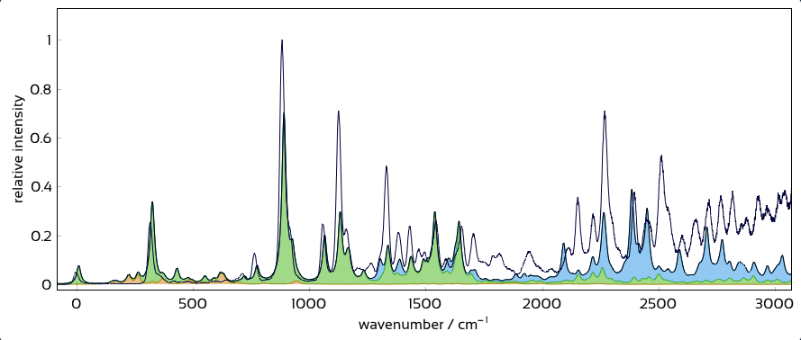

# Spectra Controls

This section explains the various ways in which the plot and spectra can be manipulated, including:
* [Moving and scaling](#moving-and-scaling-computed-spectra) of computed spectra
* Setting the **half-width** of computed spectra
* Applying **anharmonic correction factors** to different vibration types
* Showing customizable **transition labels**
* Animating vibrational modes
* Adjusting the (auto-detected) experimental peak positions
* Overlaying composite computed spectra onto the experimental one

## Moving and scaling computed spectra

The computed spectra can be moved horizontally and vertically, as well as scaled vertically, in three ways:

### Spectra control panel

Each spectrum can be individually moved using its corresponding sliders in the left control panel:

<figure><figcaption></figcaption></figure>

Additionally, using the buttons on the right-hand side of this section, one can hide the spectrum from the plot, choose its color, and reset the shift & scale parameters.

### Global vertical spacing

The global "vertical spacing" slider on the top right places all visible spectra equidistantly.

## Vibrational mode animations

## Composite Spectrum

The composite spectrum is a sum of selected computed excited-state spectra.
While the matching mode is not active, the composite spectrum is shown as an overlay over the experimental spectrum:

<figure></figure>

This can be quite useful while aligning the computed spectra with the experimental data. To add or remove spectra from the composite, you can:
- Hold `Ctrl` and click on a computed spectrum in the plot to quickly add or remove it.
- Use the checkboxes in the **Composite Spectrum** panel to include or exclude specific excited states:

<figure></figure>

In the bottom of this panel, you can choose how the composite spectrum and its components are displayed:
- **Composite spectrum**: The sum of all individual component spectra, as a line (white/black).
- **Component spectra**: The component spectra, stacked on top of each other, as colored lines.
- **Shaded contributions**: The area under each component spectrum is colored.

This is quite fun to play with:
<figure></figure>

> 📝 Note: Peak labels are a property of the component spectra. Thus, if you turn off the **component spectra** option, the labels will disappear.
